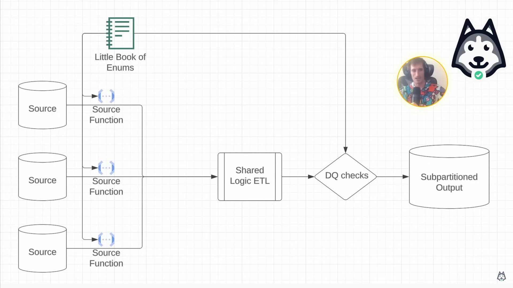
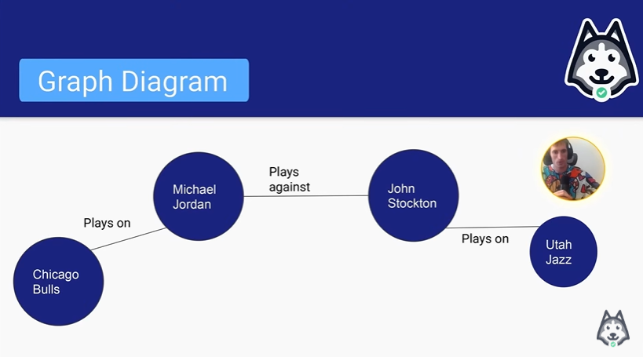

# Data Modeling - Graph Database & Additive Dimensions
> Graph Data Modeling: more relationship focus, less entity focus. Schema is flexible

## Contents

- Additive vs non-additive dimensions
- The power of Enums
- When should you use flexible data types? (map)
- Graph data modeling

## Additive vs non-additive dimensions

- Additive dimensions mean that you don't "double count"
- Application interface is NOT additive
- Example:
    - Age is additive: Total population = # of people 20yo + # of people 30 yo, ...
    - Number of active users != # of users on web + # of users on Android: not additive

> Một dimension được gọi là "additive" nếu các measure liên quan đến dimension đó có thể được cộng lại hoặc tổng hợp qua tất cả các mức (level) của dimension đó. Ví dụ thực tế: Doanh thu: **Thời gian (Time)**: Doanh thu có thể cộng qua các tháng, quý, năm. **Khu vực địa lý (Location)**: Số lượng sản phẩm bán ra có thể cộng qua các thành phố, tỉnh, hoặc quốc gia.

> Một dimension được gọi là "non-additive" nếu các measure liên quan không thể được tổng hợp hoặc cộng lại một cách chính xác qua tất cả các mức của dimension đó. Ví dụ: Số dư tài khoản (Account Balance) không thể cộng qua các khách hàng nếu không xét logic thời gian.

- The essential nature of additivity: A dimension is additive over a specify window of time, if and only if, the grain of data over that window can only ever be one value at a time

- How does additivity help
    - You don't need to use COUNT(DISTINCT) on preaggregated dimensions
    - Remember non-additive dimensions are usually only non-additive with respect to COUNT aggregations but not SUM aggregations. Example: Still SUM total number of miles driven by Honda = number of miles Civic and number of miles Corolla. But not ratio metric

> Easy way to check: Can a user be two of these at the same time in a given day. If they can, it is non-additive

## The power of Enums

- When should you use enums
    - Enums are great for low-to-medium cardinality
    - Country is a great example of where Enums start to struggle

- Why should you use enums
    - Built in data quality: pipeline failed if value not match
    - Built in static fields
    - Built in documentation

- Enumerations and subpartitions
    - Enumerations make amazing subpartitions because
        - You have an exhaustive list
        - They chunk up the big data problem into manageable pieces
    - If you have the exhaustive list of all of the possible values for a partition then you can build a pipeline that covers everything.
    - The little book of enums: https://github.com/EcZachly/little-book-of-pipelines
        

- What type of use cases is this enum pattern useful? Whenever you have tons of sources mapping to a shared schema
    - Airbnb: Unit Economics (fees, coupons, credits, insurance, infrastructure cost, taxes, etc)
    - Netflix: Infrastructure Graph (applications, databases, servers, code bases, CI/CD jobs, etc)
    - Facebook: Family of Apps (oculus, instagram, facebook, messenger, whatsapp, threads, etc)

## Flexible Data Types

- How do you model data from disparate sources into a shared schema: Flexible schema

> JSON like realtime database in Firebase

- Flexible schemas
    - Benefits
        - You don't have to run ALTER TABLE commands
        - You can manage a lot more columns
        - Your schemas don't have a ton of "NULL" columns
        - "Other_properties" column is pretty awesome for rarely-used-but-needed columns
    - Drawbacks
        - Compression is usually worse (especially if you use JSON)
        - Readability, queryability

## Graph Data Modeling

> Graph modeling is RELATIONSHIP focused, not ENTITY focused (We don't care about columns). It's shifting the focus from how things are to how things are connected

- Because of this, you can do a very poor job at modeling the entities
    - Usually the model looks like (Node/Vertex)
        - Identifier: STRING
        - Type: STRING
        - Properties: MAP<STRING, STRING>

> If you can remember this schema, you essentially have your graph data modeling skill mastered

- The relationships are modeled a little bit more in depth
    - Usually the model looks like (Edges)
        - subject_identifier: STRING
        - subject_type: VERTEX_TYPE
        - object_identifier: STRING
        - opject_type: VERTEX_TYPE
        - edge_type: EDGE_TYPE
        - properties: MAP<STRING, STRING>

    - Example: subject doing the thing to object
        - subject_identifier: `player_name`
        - subject_type: `player`
        - object_identifier: `team_name`
        - opject_type: `team`
        - edge_type: `play_on`
        - properties: How many years he plays on that team, ...

    
