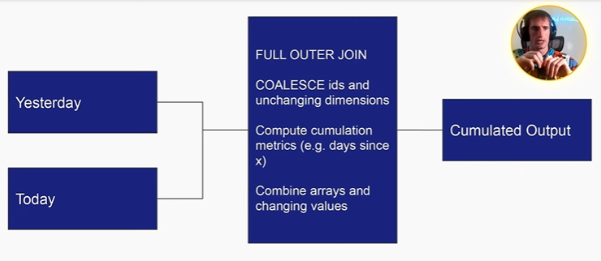
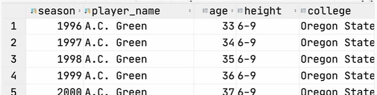
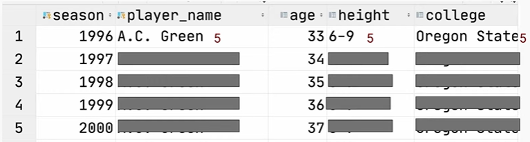
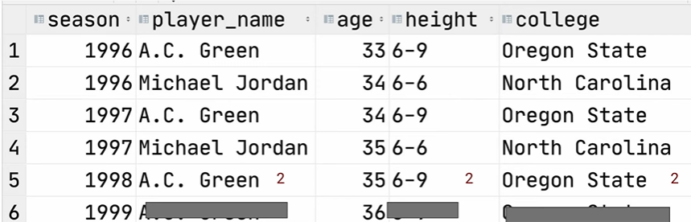

# Data Modelling - Complex Data Types and Cumulation
Link: https://youtu.be/5U-BbZ9G_xU

## What is a dimension?

- Dimensions are attributes of an entity
    - Some of these dimensions may IDENTIFY an entity (e.g. a user's ID)
    - Others are just attributes

- Dimensions come in two flavors
    - Slowly-changing
    - Fixed

## Contents
- Knowing your data consumer
- OLTP vs OLAP data modeling
- Cumulative Table design
- The compactness vs usability tradoff
- Temporal cardinality explosion
- Run-length encoding compression gotchas

## Knowing you Consumer
- DA/DS: Should be very easy to query. Not many complex data types
- Other DE: Should be compact and probably harder to query. Nested types are okay
- ML models: Depends on the model and how its trained
- Customers: Should be a very easy to interpret chart

## OLTP vs master data vs OLAP
- OLTP (Online Transaction Processing): Optimizes for low-latency, low-volumn queries
- OLAP (Online Analytical Processing): Optimizes for large volumn, GROUP BY queries, minimizes JOINs
- Master Data: Optimizes for completeness of entity definitions, deduped

> OLTP and OLAP is a CONTINUUM
    
    Production Database Snapshots -> Master Data -> OLAP Cubes -> Metrics

## Cumulative Table Design

| Date       | Daily Sales | Cumulative Sales  |
|------------|-------------|-------------------|
| 2024-01-01 | 1000        | 1000              |
| 2024-01-02 | 2000        | 3000              |
| 2024-01-03 | 1500        | 4500              |

- Core components
    - 2 dataframes (yesterday and today)
    - FULL OUTER JOIN the two dataframes together
    - COALESCE values to keep everything around
    - Hang onto all of history
- Usages
    - Growth analytics at Facebook (dim_all_users), this is just an example (ChatGPT)

        | Date       | New Users | Returning Users | Total Active Users  | Cumulative Users  |
        |------------|-----------|-----------------|---------------------|-------------------|
        | 2024-01-01 | 500       | 200             | 700                 | 500               |
        | 2024-01-02 | 600       | 300             | 900                 | 1100              |
        | 2024-01-03 | 800       | 400             | 1200                | 1900              |

    - State transition tracking (Analytics track, Applying analytical patterns cover later)

        | User ID | Date       | Previous State | Current State | Transition Reason         |
        |---------|------------|----------------|---------------|---------------------------|
        | 001     | 2024-01-01 | Onboarding     | Active        | Completed setup           |
        | 002     | 2024-01-02 | Active         | Inactive      | No activity for 30 days   |
        | 003     | 2024-01-03 | Inactive       | Churned       | Account cancellation      |
        | 001     | 2024-01-10 | Active         | Inactive      | No activity for 30 days   |

        **Onboarding**: New signuped user
        **Churned**: Not use anymore

- Diagram

    

- Cumulative Table Design
    - Strengths
        - Historical analysis without shuffle
        - Easy "transaction" analysis
    - Drawbacks
        - Can only be backfilled sequentially
        - Handling PII (Personally Identifiable Information) data can be a mess since deleted/inactive users get carried forward

## The compactness vs usability tradeoff
- The most usable tables usually
    - Have no complex data types
    - Easily can be manipulated with WHERE and GROUP BY
    > Use when analytics is the main consumer and the majority of consumers are less technical
- The most compact tables (not human readable) - reduce the I/O
    - Are compressed to be as small as possible and can't be queried directly until they're decoded
    > For online systems where latency and data volumes matter a lot. Consumers are usually highly technical
- The middle-ground tables
    - Use complex data types (e.g. ARRAY, MAP and STRUCT), making querying trickier but also compacting more
    > Upstream staging/master data where the majority of the consumers are other data engineers

- Struct vs Array vs Map
    - Struct
        - Keys are rigidly defined, compression is good
        - Values can be any type
    - Map
        - Keys are loosely defined, compression is okay
        - Values all have to be the same type
    - Array
        - Ordinal
        - List of values that all have to be the same type

## Temporal Cardinality Explosions of Dimensions
- When you add a temporal aspect to your dimensions and the cardinality increases by at least 1 order of magnitude
- Example: Airbnb has 6 million listings, we want to know the nightly pricing and available of each night for the next year
    - 365 * 6 million ~ 2 billion nights
    - Should this dataset be:
        - Listing-level with an array of nights
        - Listing night level with 2 billion rows (temporal)
    - If the sorting right, Parquet will keep these two about same size (compress)

- Badness of denormalized temporal dimensions: When joining, Spark shuffle will ruin the compression

## Run-length encoding compression
- Probably the most important compression technique in big data
- Shuffle can ruin this (shuffle happens in distributed environments when you do JOIN and GROUP BY)
- Before compression
    
- After compression
    
- Spark shuffle will mix up the ordering of the rows and ruin the compression
    

- Two ways to solving the problem:
    - Make sure to resort after the join
    - Instead of having all these players' name and sessions broken out as rows, we can have one row with player's name and all of the sessions as array. So after joining by player's name we can explode out the seasons array into rows later (the sorting will be kept together within the player's name)