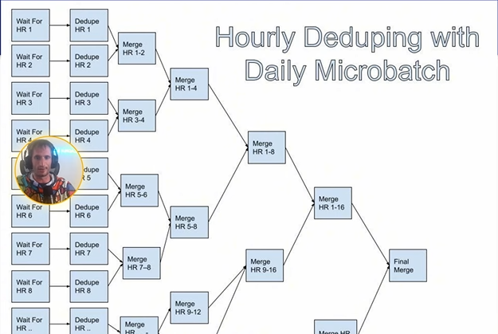

# Fundamentals of Fact Data

## What is a fact

> Like a event measure, never change

Facts are not slowly changing which makes them easier to model than dimensions in some respects

## What makes fact modeling hard

- Fact data is usually 10-100x the volume of dimension data
- Fact data can need a lot of context for effective analysis
- Duplicates in facts are way more common than in dimensional data (need to dedup)

## How does fact modeling work

- Normalization vs Denormalization
    - Normalized facts don't have any dimensional attributes, just IDs to join to get that information
    - Denormalized facts bring in some dimensional attributes for quicked analysist at the cost of more storage (but make things duplizated)
- Both normalized and denormalized facts have a place

> Normalization: The smaller the scale, the better

- Fact data and raw logs are not the same thing
    - Raw logs
        - Ugly schemas designed for online systems that make data analysis sad
        - potentially contains duplicates and other quality errors
        - Usually have shorter retention
    - Fact data
        - Nice column names
        - Quality guarantees like uniqueness, not null, etc
        - Longer retention

- Think of this as a few Who, What, Where, When, and How
    - _Who_ fields are usually pushed out as IDs
    - _Where_ fields most likely modeled out like Who with "IDs" to join, but more likely to bring in dimensions, like "device_id"
    - _How_ fields are very similar to _Where_ fields
    - _What_ fields are fundamentally part of the nature of the fact
        - In notification world: GENERATED, SENT, CLICKED, ...
    - _When_ fields are fundamentally part of the nature of the fact
        - Mostly an "event_timestamp", "event_date"

- Fact datasets should have quality guarantees: No duplicate, What and When fields always not null, ...
- Fact data should generally be smaller than raw logs
- Fact data should parse out hard-to-understand columns (barely complex data type like big blob json)

## When should you model in dimensions

- Example: Network logs pipeline
    - Check which microvervices app each network request came from and went to
    - Modeling this as a traditional fact data
    - Need to broadcast IPv4 address dimension (worked because the cardinality was small enough to join)
    - Couldn't use this strategy to IPv6
    - Solution: Log the app field with each network request and get rid of the join, so the fact data is denormalized

## How does logging fit into fact data

- Logging brings in all the critical context for your data
    - Usually done in collaboration with onlint system engineers
- Log only what you really need
- Logging should conform to values specified by the online teams
    - Thrift

## Potential options when working with high volume fact data

- Sampling: Doesn't work for all use cases, works best for metric-driven use-cases where imprecision (security, ...) isn't an issue (create gaussian, normal distribution -> create directionality)
- Bucketing
    - Fact data can be bucketed by one of the important dimension
    - Bucket joins can be much faster than shuffle joins
    - Sorted-merge Bucket (SMB) joins can do joins without Shuffle at all

## How long should you hold onto fact data

- High volumes make fact data much more costly to hold onto for a long time
- Big tech approach:
    - Fact tables < 10TBs: Retention didn't matter much
    - Fact tables > 100TBs: very short retention (~14 days)

## Deduplication of fact data

- Facts can often be duplicated
- How do you pick the right window for reduplication
    - No dup in a day/hour/week
- Intraday deduping options
    - Streaming
    - Microbatch

### Streaming to deduplicates facts

- Streaming allows you to capture most duplicates in a very efficient manner
    - Window matter: 15 min to hourly are a sweet spot
    - Entire day duplicates can be harder because of big window of memory

### Hourly Microbatch Dedupe
- Used to reduce landing time of daily tables that dedupe slowly
- (Dedupe in hour) Using `GROUP BY` for dedupe, `SUM` and `COUNT` to aggregate duplicates, use `COLLECT_LIST` to collect metadata about the duplicates that might be different

        SELECT
            product_id, 
            event_type,
            MIN(event_timestamp_epoch) AS min_event_timestamp_epoch, --get first dup
            MAX(event_timestamp_epoch) AS max_event_timestamp_epoch, --last dup
            MAP_FROM_ARRAYS(
                COLLECT_LIST(event_location), 
                COLLECT_LIST(event_timestamp_epoch)
            ) AS event_locations
        FROM event_source
        GROUP BY product_id, event_type; 

    - Result example

        | user_id | event_location | event_timestamp_epoch |
        |---------|----------------|-----------------------|
        | 1       | A              | 1000                  |
        | 1       | B              | 2000                  |
        | 2       | C              | 1500                  |
        | 2       | D              | 2500                  |

        | user_id | event_locations                     |
        |---------|-------------------------------------|
        | 1       | {"A": 1000, "B": 2000}              |
        | 2       | {"C": 1500, "D": 2500}              |

- (Dedupe between hours) Using `FULL OUTER JOIN`, using `left.value` + `right.value` to keep duplicates aggregation correctly counting or CONCAT to continuous list

        WITH earlier AS (
            SELECT * FROM hourly_deduped_source -- result of prev step
            WHERE {ds_str}
                AND hour = {earlier_hour}
                AND product_name = {product_name}
        ),
        later AS (
            SELECT * FROM hourly_deduped_source
            WHERE {ds_str}
                AND hour = {later_hour}
                AND product_name = {product_name}
        )
        SELECT
            COALESE(e.product_id, l.product_id) AS product_id, 
            COALESE(e.event_type, l.event_type) AS event_type,
            COALESE(e.min_event_timestamp_epoch, l.min_event_timestamp_epoch) AS min_event_timestamp_epoch, -- earliest start dup
            COALESE(l.max_event_timestamp_epoch, e.max_event_timestamp_epoch) AS max_event_timestamp_epoch, -- oldest end dup
            CONCAT(e.event_locations, l.event_locations) AS event_location -- store all metadata
        FROM earlier e
            FULL OUTER JOIN later l
                ON e.product_id = l.product_id
                    AND e.event_type = l.event_type;

- Like branches of a tree

    

