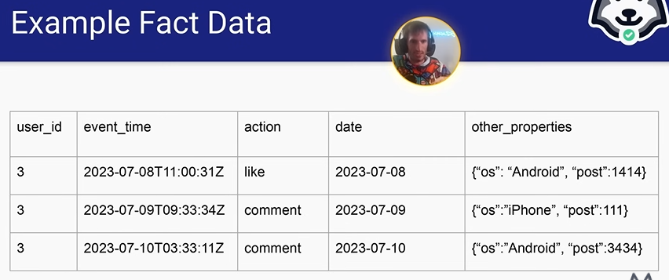
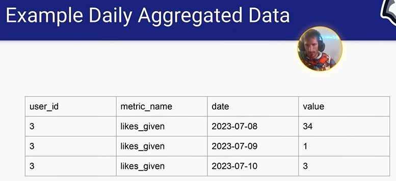
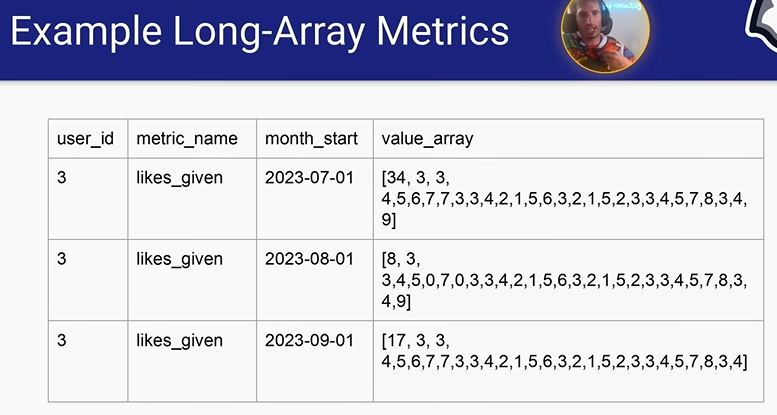

# Reducing Shuffle with Reduced Facts

## Why should shuffle be minimized

> It's bottleneck for parallelism (because it gets all data need to min number of machines)

- Big data leverages parallelism as much as it can
- Some steps are inherently less _parallelizable_ than others

## What types of queries are highly parallelizable

- Extremely parallel
    - `SELECT`, `FROM`, `WHERE`
- Kinda parallel
    - `GROUP BY` - need shuffle once to group data into one machine 
    - `JOIN` - shuffle twice to get all keys in left side and all keys in right side
    - `HAVING` - because it come with `GROUP BY`
- Painfully not parallel - **SHOULD NEVER USE**
    - `ORDER BY` (in the end of the query, not in the window function) because it needs the global sort in all machines, so all the data need to pass on **one** machine 

**What about `ORDER BY` in the window function**

- The window function doesn't do a global sort (it can if we don't use `PARTITIONED BY`), remember to partition

## How do you make `GROUP BY` more efficient

- Give `GROUP BY` some buckets and guarantees (more in Spark - Week 5)
- REDUCE THE DATA VOLUME AS MUCH AS YOU CAN

## How reduced fact data modeling gives you superpowers

- Fact data often has this schema
    - `user_id`, `event_time`, `action`, `date_partition`
    - Very high volume, 1 row per event

- Daily aggregate often has this schema
    - `user_id`, `action_cnt`, `date_partition`
    - Medium sized volume, 1 row per user per day

- Reduced fact take this one step further 
    - `user_id`, `action_cnt` Array, `month_start_partition` / `year_start_partition`
    - Low volume, 1 row per user per month/year

> Reduced fact really minimize the shuffle

> Trade off: Data get smaller, you lose the flexibility around what kind of data analytics you want to do on it, but worth the trade off of being able to do analytics more quickly

### Example Fact Data

- Very flexible, good for specific question
- Very small time horizon (like recently), volume too big

### Example Daily Aggregated Data

- Work great with longer horizon

### Example Reduced Fact (Long-Array Metrics)

- One row per month, not monthly aggregate (still has all data each day in month stored in an array)
- Date is index: 34 is 07-01, 3 is 07-02, ... (similar to date list, except now it's non-binary)

## How reduced fact data modeling gives you superpowers
- The daily dates are stored as an offset of month_start/year_start
    - First index is for date month_start + zero_days
    - Last index is for date month_start + array_length - 1

- Dimensional joins get weird if you want things to stay performant
    - Your SCD accuracy becomes the same as month_start or year_start
        - You give up 100% accuracy SCD tracking for massively increased perfomance
    - You need to pick snapshots in time (month start or month end or both) and treat the dimensions as fixed

- Impact of analysis
    - Multi-year analyses took hours instead of weeks
    - Unlocked "decades-long slow burn" analyses at Facebook

- Allowed for fast correlation analysis between user-level metrics and dimensions
