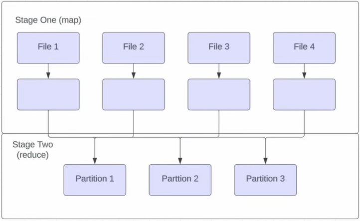
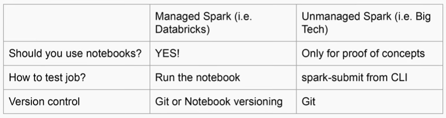

# Apache Spark

## What is Apache Spark

Spark is distributed compute framework that allows you to process very large amounts of data efficiently

## Why Spark

- Spark leverages RAM much more  efficiently than previous iterations of distributed compute (WAY faster than Hive/Java MapReduce/etc)

- Spark is storage agnostic, allowing a decoupling of storage and compute
    - Spark makes it easier to avoid vendor lock-in

- Spark has a huge community of developers

## How does Spark work

- Spark has a few pieces to it
    - The plan
    - The driver
    - The executors

- The plan
    - This is the transformation you describe in Python, Scala, or SQL
    - The plan is evaluated lazily
        - Lazy evaluation: "execution only happens when it needs to"
    - When does execution "need to" happen?
        - Writing output
        - When part of the plan depends on the data itself

- The driver
    - The driver reads the plan
    - Important Spark driver settings
        - `spark.driver.memory` - The amount of memory that the driver has to process the job, default: 2GB
        - `spark.driver.memoryOverheadFactor` - What fraction the driver needs to non-heap related memory, usually 10%, might need to be higher for complex jobs
    > "Do not touch other settings" - Zach Wilson
    - Driver needs to determine a few things
        - When to actually executing the job and stop being lazy
        - How to JOIN datasets
        - How much parallelism each step needs

- The executors 
    - The driver passes the plan to the executors
        - `spark.executor.memory` - Determines how much memory each executor gets. A low number here may cause Spark to "spill to disk" which will cause your job to much slower
        - `spark.executor.cores` - How many tasks can happen on each machine (default is 4, shouldn't go higher than 6)
        - `spark.executor.memoryOverheadFactor` - What % of memory should an executor use for non-heap related tasks, usually 10%. For jobs with lots of UDFs and complexity, you may need to bump this up

## The typs of JOINs in Spark

- Shuffle sort-merge Join
    - Default JOIN strategy since Spark 2.3
    - Works when both sides of the join are large

- Broadcast Hash Join
    - Works well if the left side of the join is small
    - `spark.sql.autoBroadcastJoinThreshold` (default is 10 MBs, can go as high as 8GBs, you'll ecperience weird memory problems > 1 GB)
    - A join **without** shuffle

- Bucket Joins
    - A join without shuffle

## How does shuffle work



- This is the least scalable in Spark

## Shuffle

- Shuffle partitions and parallelism are linked
    - Shuffle partitions and parallelism
        - `spark.sql.shuffle.partitions` and `spark.default.parallelism` - for the most path, exact same thing
        - Just use `spark.sql.shuffle.partitions` since the other is related to the RDD API you shouldn't be using

- Is shuffle good or bad
    - At low-to-medium volume
        - It's really good and makes our lives easier
    - At high volumes > 10 TBs
        - Painful
        - At netflix, shuffle killed the IP enrichment pipeline

> Always bucket your table by power of two

## How to minimize Shuffle at high volumes

- Bucket the data if multiple JOINs or aggregations are happening downstream
- Spark has the ability to bucket data to minimize or eliminate the need for shuffle when doing JOINs
- Bucket joins are very efficient but have drawbacks
- Main drawback is the initial parallelism = number of buckets
- Bucket joins only work if the two tables number of buckets are multiples of each other
    - Always use powers of 2 for # of buckets

## Shuffle and Skew

- Sometimes some partitions have dramatically more data then others. This can happen because
    - Not enough partitions
    - The natural way the data is
        - Beyond gets a lot more notifications than the average Facebook user

## How to tell if your data is skewed

- Most common is a job getting to 99%, taking  forever, and failing
- Another more scientific way is to do a box-and-whiskers plot of the data to see if there's any extreme outliers

## Ways to deal with Skew

- Adaptive query execution - only in Spark 3+
    - Set spark.sql.adaptive.enabled = True
- Salting the `GROUP BY` - best option before Spark 3
    - `GROUP BY` a random number, aggregate + GROUP BY again
    - Be careful with things like AVG - break it into SUM and COUNT and divide
        
    ```
    df.withColumn("salt_random_column", (rand * n).cast(IntegerType))
      .groupBy(groupByFields, "salt_random_column")
      .agg(aggFields)
      .groupBy(groupByFields)
      .agg(aggFields)
    # checkout fact type (additive, semi-additive, ...)
    ```

## Spark on Databricks versus regular Spark



## How can Spark read data

- From the lake: Delta Lake, Apache Iceberg, Hive metastore
- From an RDBMS: Postgres, Oracle, etc
- From an PI: Make a REST call and turn into data
- From a flat file (CSV, JSON)

## Spark output datasets

- Should almost always be partitioned on "date"
    - This is the execution date of the pipeline
    - In big tech this is called "ds partitioning"